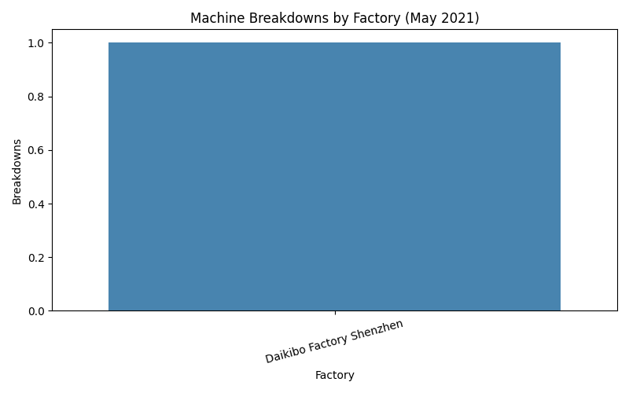

# Daikibo Telemetry Analysis  
### Deloitte Virtual Internship Project  
**By Riya Makwana – PIET MCA-AI**

---

 **Technologies Used:**  
`Python` · `Pandas` · `Matplotlib` · `Seaborn` · `JSON`  

 **Data Period:** May 2021  
 **Factories:** Tokyo, Osaka, Berlin, Shenzhen  

---
 **Objective:**  
Analyze one month of telemetry data from four Daikibo factories to answer:
1. In which location did machines break the most?  
2. What are the machines that broke most often in that location?

---

